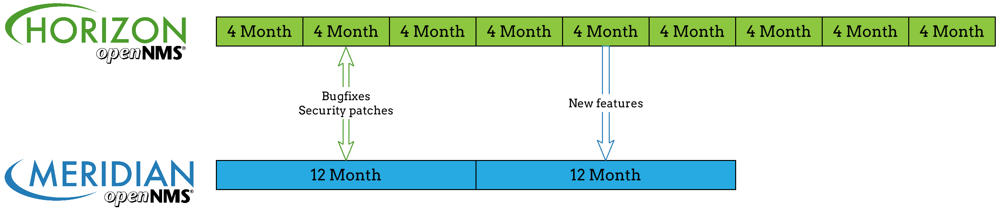
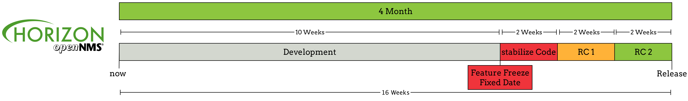

OpenNMS is released and distributed in two flavors _Horizon_ and _Meridian_.
Both distributions are released under the AGPLv3 license model.
The _Horizon_ release follows a main release cycle of _**3-4 month**_.
All new features are developed in _Horizon_ and the repository is public.
The OpenNMS Group, Inc. provides the _Meridian_ distribution with commercial support and a main release cycle of _**~12 month**_ and support is given for an extended lifetime.
Security and bugfix patches are maintained by The OpenNMS Group, Inc. and back ported between the two distributions.
To get patches and fixes, it is required to have a _Meridian_ subscription for the repository access.

Bugfixes and security patches are shared and new features will be moved from _Horizon_ to _Meridian_.
The decision to release new features in _Horizon_ is community driven and the for _Meridian_ it is driven by The OpenNMS Group, Inc.
To release the software the community and The OpenNMS Group uses the public available JIRA issue tracking software.

* Development: Phase to develop new features, changes in architecture and major bug fixes. This state can be installed as OpenNMS Horizon SNAPSHOT release. Changes are merged from pull requests after reviewing and testing. Major releases can require configuration changes or data migration.
* Feature Freeze: No features are pulled in develop branch. The code base get stabilized and get ready for a first release condidate.
* Stabilize code: Getting problems solved, missing unit tests are added, outstanding review are done, fixes are made and get Continuous Integration green. Preparation for Release Candiate 1
* Release Candidate 1 (RC1): Test phase driven be OpenNMS community. Hotfixes can be made and applied to development branch during the test phase.
* Release Candidate 2 (RC2): Test phase with applied hot fixes from RC1
* Release: Release date for OpenNMS Horizon which can be installed as Stable release.

Phases for releases are announced on the OpenNMS Developers mailing list.
Releases are announced on the OpenNMS announce mailing list and can also be found as entry on the OpenNMS Website and changes are published in Release Notes.
