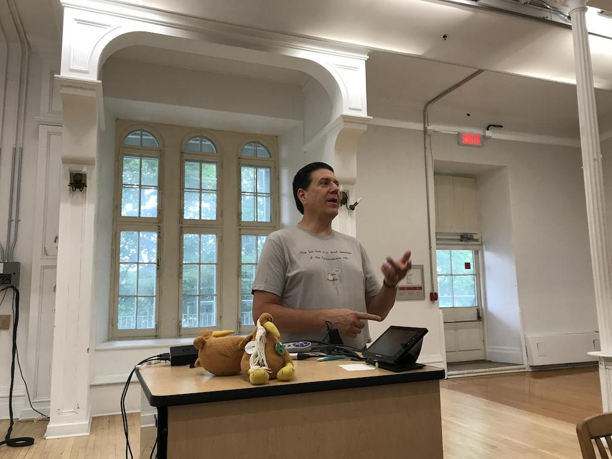
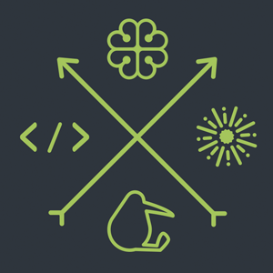
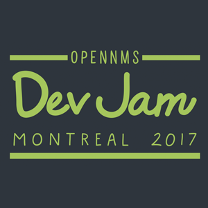

It's time for This Week in OpenNMS!  In the last week we worked on various internals and web code.

<!-- git log --all --no-merges --since='2017-07-10 00:00:00' --until='2017-07-17 00:00:00' --format='%Cblue%ai %Cgreen%aN %Cred%d %Creset%s %Cblue(%H)' | sort | less -R -->

## Github Project Updates

* __Internals, APIs, and Documentation__

  * Jesse fixed maskelement matches for events
  * Jesse worked on a project to provide alarm correlation
  * Seth worked on upgrading Karaf to 4.1
  * Ronny worked on AsciiBinder documentation infrastructure
  * Alejandro fixed varbind matching of events

* __Web and UI__

  * Seth did more work on alarm endpoints in the ReSTv2 API
  * Alejandro made it possible to associate foreign sources and IDs with events sent through ReST
  * Markus worked on a bunch of BSM and topology issues
  * Dustin worked on GraphML topology status propagation
  * Markus worked on OSGi ReST support
  * Markus made an outage-based node status calculator
  * I added support for ack/unack/escalate/clear of alarms in OpenNMS.js
  * Jesse added support for handling alarm sticky and journal memos to OpenNMS.js, and added support for displaying them in Grafana

## OpenNMS Horizon 20.0.1 ([Korben Dallas](http://fifth-element.wikia.com/wiki/Korben_Dallas)) Released

OpenNMS Horizon 20.0.1 was released last Monday.  It contains fixes for number of bugs introduced in 20 including a deadlock in polling.

For a complete list of what was changed, see [the release notes](http://bit.ly/opennms-changes-20-0-1).

## Dev-Jam 2017

While I am writing this TWiO, Tarus and Jesse are introducing Dev-Jam 2017 at Concordia University in Montréal, Canada.  Dev-Jam is our yearly OpenNMS un-conference where everyone gets a chance to socialize and to work on their own personal OpenNMS projects.

This morning everyone introduced themselves and talked about what they planned on doing:

* updating packaging (yum/Debian) infrastructure including better support of upstream PostgreSQL packages
* improved wifi link support in Enlinkd and topology
* improving the opennms.com and opennms.org web sites
* simplifying collection of OCAs
* integrating DigitalOcean and Xen requisition tools
* Spark chat integration
* ReST infrastructure improvements
* discussing how to improve Docker image generation
* grafana dashboard for UPS data
* northbound interfaces for Drools (scriptd-like interface for alarms)
* structured data monitor (using the XML collector infrastructure)
* Cisco ACI integration
* OSGi deployment of ReST services
* donut charts on the front page
* rewrite the node list page
* migrate documentation to AsciiBinder
* trigger IFTTT events when alarms change
* porting the Go version of the minion to a new platform

Obviously not all of this will get done in a week, but there are lots of neat things going on.  Stay tuned for cool new features in OpenNMS Horizon 21.0.0!

Also, Jessica handed out this year's t-shirt, with an awesome design:

 

## Upcoming Events and Appearances

* __[OpenNMS Training – Apex, NC - September 11th through 15th, 2017](http://www.opennms.com/training/)__

  The OpenNMS Group's next training session in Apex, NC will be September 11th through 15th.  For more details on OpenNMS training and to sign up, see [The OpenNMS.com training page](http://www.opennms.com/training/).

* __[Ohio Linux Fest - Columbus, OH - September 29th through 30th, 2017](https://ohiolinux.org/tarus-balog-to-keynote-ohio-linuxfest-2017/)__

  Tarus Balog will be the keynote speaker at Ohio Linux Fest in Columbus.  His talk is titled _"A Short History of an Open Source Business"_ and will be about the history of OpenNMS, decisions that were made, problems that were faced, and things we'd do different.

  For details, see [the Ohio Linux Fest announcement](https://ohiolinux.org/tarus-balog-to-keynote-ohio-linuxfest-2017/).

## Until Next Week…

If there’s anything you’d like me to talk about in a future TWiO, or you just have a comment or criticism you’d like to share, don’t hesitate to [say hi](mailto:twio@opennms.org).

\- Ben

<!--
  https://github.com/OpenNMS/twio-fodder/blob/master/scripts/twio-issues-list.pl
-->

## Resolved Issues Since Last TWiO

* [HZN-1061](https://issues.opennms.org/browse/HZN-1061): Add an alarms endpoint to the v2 REST API
* [HZN-1062](https://issues.opennms.org/browse/HZN-1062): Add support for perform ticket related actions on alarm
* [HZN-1099](https://issues.opennms.org/browse/HZN-1099): View the all of the alarm properties for any alarm displayed in the alarm table panel
* [NMS-7309](https://issues.opennms.org/browse/NMS-7309): OpenNMS ignores signals
* [NMS-8305](https://issues.opennms.org/browse/NMS-8305): Intermittent test failures in *FeatureKarafIT tests
* [NMS-8857](https://issues.opennms.org/browse/NMS-8857): Make an automation to clear pathOutage alarms
* [NMS-9133](https://issues.opennms.org/browse/NMS-9133): Fix CORS section to include /api/* besides /rest 
* [NMS-9365](https://issues.opennms.org/browse/NMS-9365): Give a user the ability to visualise path outages and the status in the topology framework
* [NMS-9449](https://issues.opennms.org/browse/NMS-9449): Add support for retrieving the SNMPv2 agent address from a specific varbind
* [NMS-9484](https://issues.opennms.org/browse/NMS-9484): KSC reports broken on upgrade to 20.0
* [NMS-9491](https://issues.opennms.org/browse/NMS-9491): openNMS ignores some traps
* [NMS-9496](https://issues.opennms.org/browse/NMS-9496): Using maskelements based on nodeID (and maybe other fields) to match event definition doesn't work
