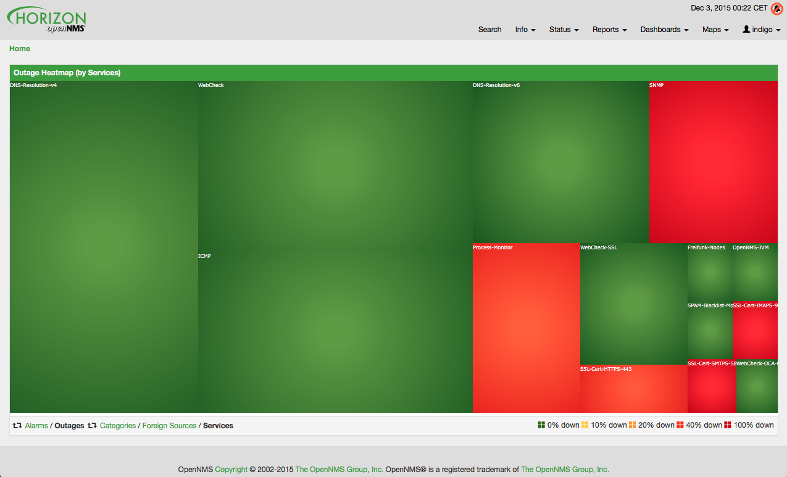
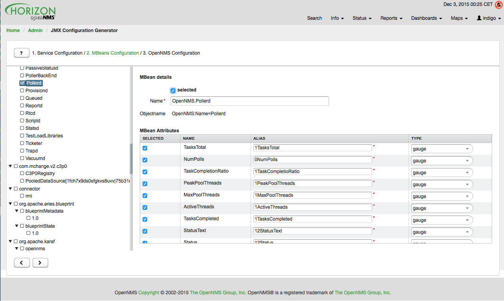

We welcome our new release of OpenNMS Horizon 17 with code name [Glen Moray](https://en.wikipedia.org/wiki/Glen_Moray_distillery).

Like a good single malt Scotch whiskey it took some time to get the release out – but we think waiting was worth it.
The most obvious change is the a more slimmed down web app layout.

We have added a new visual component to show alarms and outages in a heat map which can be used as an additional component on the start page or as a full screen view.

The JMX data collection configuration tool is reworked and improved.
It allows to interactively create your data collection configuration for your Java applications with JMX.

The [documentation](https://docs.opennms.org/opennms/releases/latest/index.html) is improved and we have removed unnecessary modules and focus on Release Notes, Installation Guide, User Guide, Administration Guide and Developer Guide.
We moved the content how to develop new documentation from the Documentation Guide to a Developers Guide section.

The distributed components with [OpenNMS Minion](https://github.com/OpenNMS/smnnepo) is introduced in the admin area.

Important to notice Linkd with the SVG map is removed. Enhanced Linkd with Topology view is now the new default.

Otherwise real SSO via Kerberos (SPNEGO) and LDAP is enabled we integrate now with OTRS-3.1+ Ticket system.

We added a JMS Alarm Northbounder to make it easier to integrate OpenNMS in larger management application stacks.

A lot of improvements to the Grafana support was made. We support now the version 2.5.0 of Grafana.
The [OpenNMS Grafana Data Source](http://www.opennms.org/wiki/Grafana) allows filtering and trending performance data and the [Newts](http://opennms.github.io/newts/) integration is improved.

We have added support for following devices:

* Added trap support for [Infoblox](https://en.wikipedia.org/wiki/Infoblox) devices
* Adding SNMP traps for [Raytheon NXU-2A](https://en.wikipedia.org/wiki/Raytheon)
* Add [A10](https://en.wikipedia.org/wiki/A10_Networks) AX load balancer trap events
* Add [Force10](https://en.wikipedia.org/wiki/Force10) Traps
* Event definition for [Juniper](https://en.wikipedia.org/wiki/Juniper_Networks) screening SNMP traps
* Event definiton file for DSVIEW-TRAP-MIB
* Trap definition files for [Evertz](https://en.wikipedia.org/wiki/Evertz_Microsystems) Multiframe and Modules
* Trap and data collection definitions for [Ceragon](https://en.wikipedia.org/wiki/Ceragon) FibeAir 1500
* New (additional) event file for [NetApp](https://en.wikipedia.org/wiki/NetApp) filer
* New [Fortinet](https://en.wikipedia.org/wiki/Fortinet) datacollection / graph definition
* Event and data collection support for Didactum Sensors
* Add Juniper SRX flow performance monitoring and default thresholds
* [Dell Equallogic](https://en.wikipedia.org/wiki/EqualLogic) Events
* Add [Sonicwall](https://en.wikipedia.org/wiki/SonicWall) Firewall Events

For more details you can go to our [Release Notes](https://docs.opennms.org/opennms/releases/latest/releasenotes/releasenotes.html).

Looking forward to upgrade my systems and Happy Upgrading

gl & hf
