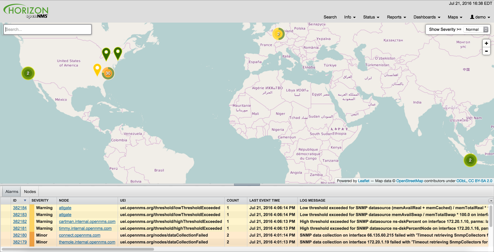

OpenNMS 18.0.1 (code name: [Platypus](https://en.wikipedia.org/wiki/Glen_Moray_distillery)) is now available.

While it contains a large number of bug fixes and a few enhancements, the most noticeable change is a fix for the distributed and geographical maps.  We had been using MapQuest's (wonderful and freely-available) OpenStreetMap-compatible tile servers, but they recently decommissioned those servers and we needed to make code changes to make using a new server possible.

Notable Changes
===============

* Newts upgraded to 1.3.6, plus many other Newts-related improvements
* Backshift graphs can be opened in a new window
* Backshift graphs now support forecasting metrics
* NRTG graphs now use Backshift for rendering
* experimental support for HikariCP, a high-performance database pooling API
* performance improvements in logging (which should improve performance system-wide)
* you can now add custom string attributes based on indirect and complex SNMP indices

For more details, see the complete [Release Notes](https://docs.opennms.org/opennms/releases/latest/releasenotes/releasenotes.html).
