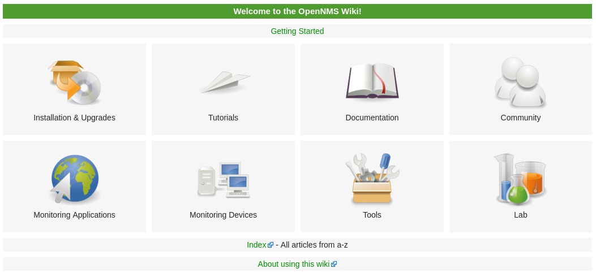

We heard the call of duty to do **something** to get the wiki more usable.
So we spent some time at the Dev-Jam to create a more structured [Wiki entry page](https://wiki.opennms.org/).

We broke up the content from the [old main page](https://wiki.opennms.org/wiki/Old_Main_Page) into categories.

Here a few thoughts behind the categories we have identified:

#### Getting Started

Every Wiki article which is related to get started with OpenNMS.
As we went through the pages, it seems especially the getting started tutorial needs a review.

#### Installation & Upgrades

All important links to the latest installation documentations and upgrade guides.

#### Tutorials

We moved most of the configuration for monitoring applications and specific devices in dedicated sections and removed them from the [Tutorials category](https://wiki.opennms.org/wiki/Category:Tutorials).
There still some articles left which are in the generic [OpenNSM Category](https://wiki.opennms.org/wiki/Category:OpenNMS) and need to be recategorized.

#### Documentation

We added a category which collects all links to documentation related topics for the projects which are related to OpenNMS like Minion, Newts, PRIS, JICMP and JICMP6.
If there is something missing please feel free to add or let us know.

#### Community

Everything related to community related stuff and social media links are moved into the Community section.

#### Monitoring Applications / Devices

This is a new section and the idea is, to make it easier to find specific vendor support configurations, eg. event configs, data collections and graph definitions.
Ronny [talked](https://www.youtube.com/watch?v=xRRVNNid5qY&index=5&list=PLsXgBGH3nG7hv4CdYVpxISdM8vZqsdxht) at the Dev-Jam about a new [Github repository](https://github.com/opennms-config-modules/) which could make it easier to add/find/create new vendor configs in future.
There probably some wiki pages with just configuration snippets which can be migrated to a GitHub configuration module which makes it easier for others to get forked, extended.

#### Tools

Different tools around OpenNMS, paste.opennms.eu to share config snippets, td.opennms.eu to analyze Thread Dumps, Source Code Browser, Issue Tracker and Continuous Integration System. 

#### Lab

Development and prototype projects for new features or proof of concepts.
We already added the Dev-jam, GSoC wikis and some projects which are related to OpenNMS Horizon 19.

#### Index

This is an overview about all articles in the Wiki in alphabetical order.

#### About Using This Wiki

Some things about using this wiki, this page still needs some update.

#### Left Toolbar

Currently the left toolbar needs some cleanup, we will remove some duplicated links and see what's left.
If you have some good ideas what should be always reachable in the left toolbar just let us know.

**Your feedback is welcome! Join our [discussion mailing list](https://lists.sourceforge.net/lists/listinfo/opennms-discuss)**
___
If you want to meet us, join the OpenNMS User Conference 13th - 15th September at https://ouce.opennms.eu
