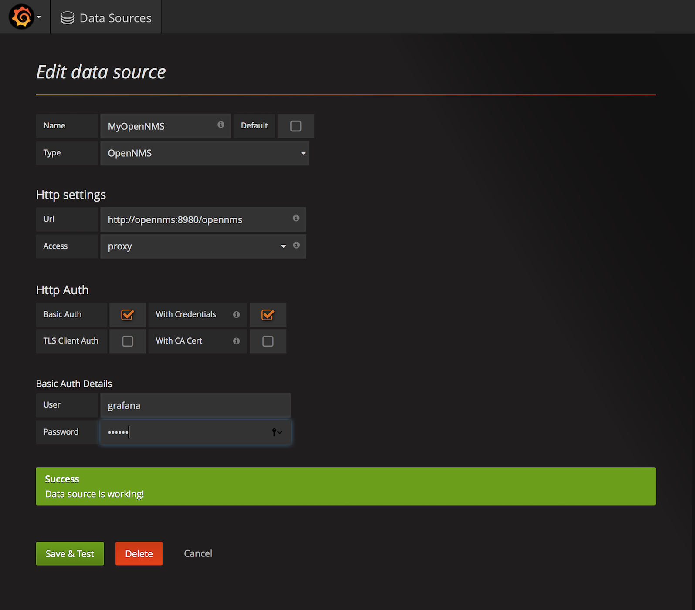

Deploying and running OpenNMS and Minions in infrastructures using containers might be interesting to some users.
For this reason, I've started to use [Docker](https://docs.docker.com/engine/installation/) infrastructure to provide a ready-to-run entrypoint to build your OpenNMS container based infrastructure.
You can find more information in the [lab section](https://wiki.opennms.org/wiki/Lab) under [Running with Docker](https://wiki.opennms.org/wiki/DevProjects/Running_with_Docker) in our wiki.
The Docker files and images can be forked on [GitHub](https://hub.docker.com/r/opennms/horizon-core-web/) and pre-built images are available on [Dockerhub](https://hub.docker.com/u/opennms/dashboard/).

To run this example, make sure you have a recent version of Docker CE 17+ and a current Docker Compose 1.22+ installed.
You can verify with `docker version` and `docker-compose version`.

OpenNMS uses a few other services like a [PostgreSQL](https://www.postgresql.org) database service, therefore I recommend that you use [Docker Compose](https://docs.docker.com/compose/) to model your OpenNMS service.
The following tutorial shows you how to build an [OpenNMS Horizon](https://www.opennms.org) with the latest stable version using [PostgreSQL 9.10](https://www.postgresql.org/docs/10/static/index.html) and [Grafana 5.2.4](https://docs.grafana.org/guides/whats-new-in-v5/).


An intermediate image is used to ease maintaining the Java JDK version for OpenNMS.
By using the `opennms:latest` version tag a [daily built](https://hub.docker.com/r/opennms/horizon-core-web/builds/) image from the OpenNMS develop branch is used.


Data for the services is stored in dedicated data containers with the exception of the OpenNMS configuration directory.
Because it is required to edit OpenNMS configuration files manually, the `/opt/opennms/etc` directory is mounted to the Docker host system.
In this example it will create the OpenNMS configuration in the current diretory in `./horizon-22.0.4-etc`.
If you want to use a different directory, just change the mount direction in the `docker-compose.yml` example.
In case the directory does not exist, the configuration files are initialized automatically from the `/opt/opennms/share/etc-pristine` directory.

The data containers are used for:

* PostgreSQL raw database files
* Grafana SQlite database with dashboards, users and plugins
* OpenNMS RRD/JRobin files, logs and created reports

The services themselves can easily be deleted or recreated without losing data.
As long the data containers are not deleted, the OpenNMS and Grafana generated data is still available.

To communicate among the containers, the name of the service can be used as the host name in URLs to access the services provided in other containers.

A suitable place to create the files is a directory like `/opt/docker-service/opennms` and `/opt/docker-service/opennms-config` for the configuration files.

### Building your service stack

The configuration of each service is defined in dedicated environment files.

Initialize PostgreSQL with a minimal configuration and provide user credentials for the `postgres` user:

_File: .postgres.env_
```
# Environment variables for generic PostgreSQL server
POSTGRES_HOST=postgres
POSTGRES_PORT=5432
POSTGRES_USER=postgres
POSTGRES_PASSWORD=postgres
```

Configure OpenNMS database connection with credentials:

_File: .opennms.env_
```
# Environment variables for OpenNMS database connection
OPENNMS_DBNAME=opennms
OPENNMS_DBUSER=opennms
OPENNMS_DBPASS=opennms
```

Configure Grafana admin credentials and server host in URL for the web interface:

_File: .grafana.env_
```
# Environment variables for Grafana
GF_SERVER_ROOT_URL=http://localhost
GF_SECURITY_ADMIN_PASSWORD=mypass
```

Create the `docker-compose.yml` file with the services and data containers, and expose the ports for network access:

_File: docker-compose.yml_
```
version: '2.3'

volumes:
  data-psql:
    driver: local
  data-horizon:
    driver: local
  data-grafana:
    driver: local

services:
  postgres:
    image: postgres:10
    container_name: postgres
    environment:
      - TZ=Europe/Berlin
    env_file:
      - .postgres.env
    volumes:
      - data-psql:/var/lib/postgresql/data
    healthcheck:
      test: ["CMD-SHELL", "pg_isready -U postgres"]
      interval: 5s
      timeout: 5s
      retries: 5

  horizon:
    image: opennms/horizon-core-web:22.0.4-1
    container_name: horizon
    environment:
      - TZ=Europe/Berlin
      - JAVA_OPTS=-XX:+UseParallelGC -XX:+PrintFlagsFinal -XX:+UnlockExperimentalVMOptions -XX:+UseCGroupMemoryLimitForHeap
    env_file:
      - .opennms.env
      - .postgres.env
    volumes:
      - data-horizon:/opennms-data
      - ./horizon-22.0.4-etc:/opt/opennms/etc
    command: ["-s"]
    depends_on:
      postgres:
        condition: service_healthy
    healthcheck:
          test: ["CMD", "curl", "-f", "-I", "http://localhost:8980/opennms/login.jsp"]
          interval: 1m
          timeout: 5s
          retries: 3
    ports:
      - "8980:8980"
      - "61616:61616"
      - "8101:8101"

  grafana:
    image: opennms/helm:latest
    container_name: grafana
    environment:
      - TZ=Europe/Berlin
    env_file:
      - .grafana.env
    volumes:
      - data-grafana:/var/lib/grafana
    healthcheck:
          test: ["CMD", "curl", "-f", "-I", "http://localhost:3000/login"]
          interval: 1m
          timeout: 5s
          retries: 3
    ports:
      - "3000:3000"
```

The whole stack can be started in the background with

```
docker-compose up -d
```

For OpenNMS Horizon, a health check shows if the web application is started and can be checked with the `docker ps` command.

Create a `OpenNMS Faults` and an `OpenNMS Performance` data source and use the URL to our OpenNMS service:

`http://horizon:8980/opennms`

We named our OpenNMS Horizon service `horizon` in our docker-compose file and we can use it as a host name to connect to it.

Use `Basic Auth` and use the OpenNMS credentials for authentication.
In this example we use the `admin` user from OpenNMS to access the REST API, you can create a REST user in the OpenNMS Web UI which has limited access if you like.

`Save & Test` will test the connectivity to the OpenNMS ReST API with the provided credentials.



Now you can start creating your own dashboards using data collected from OpenNMS.

### Build OpenNMS Minion service

If you want to test the Minion environment, make sure that you use at least the image version for release candidate OpenNMS Horizon 19 (`indigo/docker-opennms:rc-19.0.0`) or 20 (`indigo/docker-opennms:latest`).
The Minion image version should be the same as the OpenNMS Horizon version.

Running a Minion in a remote location can also be easily deployed using Docker.
The minimum configuration requirements to get a Minion running are:

* Configure OpenNMS to allow network access to ActiveMQ
* Configure OpenNMS to allow authenticated access to the ReST API
* Create a Minion service and configure a Location, Minion-ID, HTTP and Broker URL endpoints

The Minion docker image is similarly built on the same `centos-jdk8` image as OpenNMS.
It can be configured with an environment file and as a service with `docker-compose` in the same way.

Allow network access to ActiveMQ by uncommenting the following line in `opennms-activemq.xml` located in the OpenNMS configuration directory.

```
<!-- Uncomment this line to allow localhost TCP connections (for testing purposes) -->
<!-- <transportConnector name="openwire" uri="tcp://127.0.0.1:61616?useJmx=false&amp;maximumConnections=1000&amp;wireformat.maxFrameSize=104857600"/> -->
```
For production environments see [Minion Authorization](http://docs.opennms.org/opennms/branches/develop/guide-install/guide-install.html#_authentication_and_authorization) in our admin guide.

Restart OpenNMS Horizon with

```
docker-compose stop opennms && docker-compose up -d
```

Replace the `YOUR-LOCATION` and `opennms` in the URLs with values fitting your environment.
The Minion ID is a unique identifier to register this specific instance of the Minion in the OpenNMS system.
If you don't provide a Minion ID, it is generated automatically and you don't control the ID when it's lost.
To assign them manually, you can just specify them in the Minion environment file.

_File: .minion.env_

```
# Environment variables for OpenNMS Minion connection
MINION_ID=00000000-0000-0000-0000-deadbeef0001
MINION_LOCATION=YOUR-LOCATION
MINION_CONFIG=/opt/minion/etc/org.opennms.minion.controller.cfg
OPENNMS_BROKER_URL=tcp://horizon:61616
OPENNMS_HTTP_URL=http://horizon:8980/opennms
```

Define the service by creating a `docker-compose.yml` file:

```
version: '2'
services:
  minion:
    image: opennms/minion:22.0.4-1
    env_file:
      - .minion.env
    command: ["-f"]
    ports:
      - "8201"
      - "162/udp"
      - "514/udp"
```

Start the Minion service with `docker-compose up -d`.
A health check [tests the communication](http://docs.opennms.org/opennms/branches/develop/guide-install/guide-install.html#_verifying_connectivity) to the OpenNMS Horizon instance, and can be checked with the `docker ps` command.

By default the Minion is automatically provisioned in the OpenNMS system and sends a heartbeat to OpenNMS which is monitored with the `Minion-Heartbeat` service.
