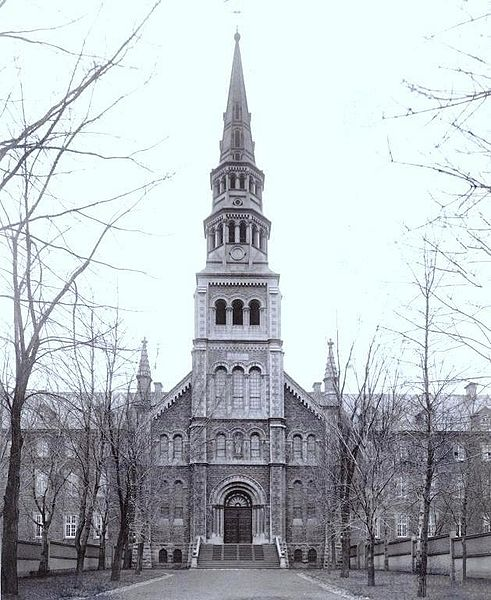

We are happy to announce our annual meeting [Dev-Jam](https://wiki.opennms.org/wiki/Dev-Jam_2017), the annual OpenNMS Developers' Conference.
This year will mark our twelfth meeting.

For the first time we will be holding Dev-Jam outside of the United States.
About a third of the attendees come from other countries and due to recent changes in US immigration policy, we couldn’t have people forced to reveal sensitive things such as [social media passwords](http://www.nbcnews.com/news/us-news/us-visitors-may-have-hand-over-social-media-passwords-kelly-n718216) just to come to Dev-Jam.

So, we are holding it at [Concordia University](http://www.concordia.ca/) in Montreal, Quebec, Canada.
Not only is Montreal an awesome city, Concordia is also the alma mater of Jesse White, one of the key architects of OpenNMS.
It should be a wonderful venue for the conference.

We have reserved a block of rooms in the historic [Grey Nuns Building](https://en.wikipedia.org/wiki/Grey_Nuns_Motherhouse).
Similar to the dorms we have used in the past, every one will get a single room with a shared bathroom.
If you would rather stay in a more conventional hotel, there are a number of excellent choices nearby, although I would strongly recommend you consider the dorm as the majority of people will be staying there and it can be quite nice.

There are also a number of other events going on in Montreal that week, including a [Metallica](http://www.evenko.ca/en/events/12202/metallica/parc-jean-drapeau/07-19-2017) concert and a [fireworks competition](https://www.quebecoriginal.com/en-us/listing/events/festivals-and-special-events/linternational-des-feux-loto-quebec-1413569), and we will try to do something as a group (baseball is out since the Expos moved to Washington, DC, in 2004).

Space is limited. More details can be found on the [wiki](https://wiki.opennms.org/wiki/Dev-Jam_2017) and [registration is now open](http://www.opennms.com/opennms-dev-jam-registration).

Hope to see you there, and yes, there will be [poutine](https://en.wikipedia.org/wiki/Poutine).
