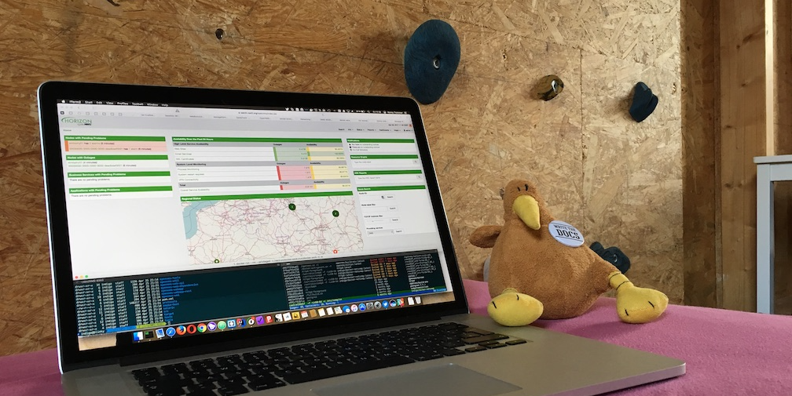

Hello World,

as some of you remember we had an Easterhack some days ago.
Marcel Fuhrmann and Markus von Rüden organised the event and Marcel sponsored a place in his home to give some OpenNMS guys a place to stay to hack, eat, drink, talk and some fun.
Here are a few things what we did (besides playing Guitar Hero, trying his home build climbing wall, eating Pizza and drinking [Mead](https://en.wikipedia.org/wiki/Mead) :)

* We had a topic about best practices to monitor system processes and the result is published in the opennms.org [blog section](https://www.opennms.org/en/blog/2017-05-09-process-monitoring-snmp)
* Markus von Rüden started to work on an enhancement on the start page with some new UI elements to show the overall monitoring status. The feature is targeted for next major release **Horizon 20**.
  Some screenshots and the motivation is documented in our Wiki in the [Lab-Section](https://wiki.opennms.org/wiki/DevProjects/Status_Box).
  Please use the opennms-discuss mailing list or the opennms-discuss chat if you want to give positive or negative feedback - which is highly appreciated.
* Ronny migrated our conference management system software [frab](http://frab.github.io/frab/) to a [Docker service](https://hub.docker.com/r/opennms/frab/) which will be used for OUCE 2018
* Daniel Krah started some work together with Marcel to get our Mascot Ulf 3D modeled to get integrated with [SuperTuxKart](https://supertuxkart.net/Main_Page)
* Marcel Fuhrmann spent some time to gather information for a new tutorial how to monitor LSI Megaraid controller with SNMP
* Marcel Fuhrmann and Markus von Rüden documented the [JMX Monitor](https://github.com/OpenNMS/opennms/pull/1460)

If you are interested in sharing a story in the opennms.org blog section; feel free - the page and the content is on [GitHub](https://github.com/opennms-forge/opennms.org) and waiting for Pull Requests or just hit me and I’m happy to help.
Otherwise don’t hesitate to [say hi](https://www.opennms.org/en/participate).

I would like to send a "Big Thank You" to Marcel and his Family hosting our first Hackathon- You Rock!

So Long, and Thanks for All the Fish