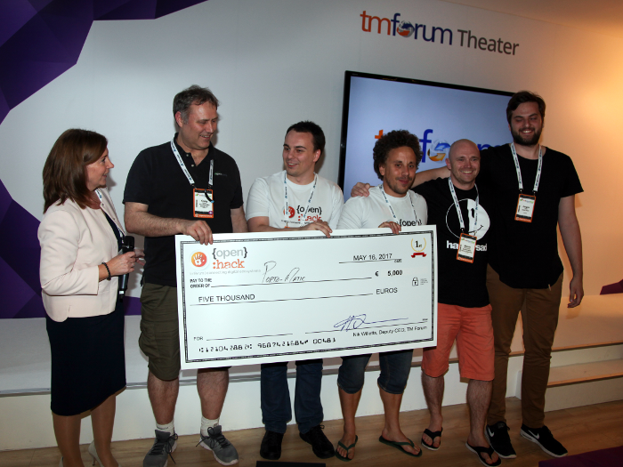
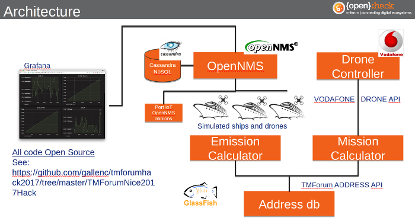
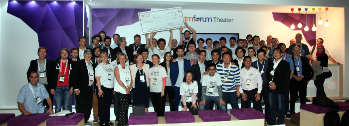

A group of four students from [Southampton Solent University](https://www.solent.ac.uk/), mentored by Dr. Craig Gallen, used [OpenNMS](https://www.opennms.org/) to win the top prize at the TeleManagement Forum [{open}:hack competition](https://inform.tmforum.org/uncategorized/2017/05/open-hack-network-slicing-exposes-winning-innovation/) at the [TM Forum Live](https://www.tmforumlive.org/) conference in Nice, France.

Now, a little background is in order.
Dr. Gallen founded [Entimoss](http://entimoss.myzen.co.uk/), our [OpenNMS](https://www.opennms.com/) partner in the UK and Ireland.
He got involved with OpenNMS over a decade ago when he was working on his doctoral thesis entitled "Improving the Practice of Operations Support Systems in the Telecommunications Industry using Open Source".

Most of his work was focused on a business solution framework called NGOSS (now [Frameworx](https://en.wikipedia.org/wiki/Frameworx)) developed by the TM Forum for creating next generation [OSS](https://en.wikipedia.org/wiki/Operations_support_system)/[BSS](https://en.wikipedia.org/wiki/Business_support_system) software and systems.
The TM Forum is the world’s leading trade organization for telecommunications providers. At that time, it was not very friendly toward open source.
He demonstrated how an open source platform like OpenNMS could be used to integrate with and tie together these different interfaces to build a reference implementation for part of the framework. Open source was a new concept for the industry, and we were branded the “open source pirates” at first. But Craig persisted, and in 2011 he was awarded the TM Forum’s [Outstanding Contributor Award](https://www.adventuresinoss.com/2011/01/27/2025/).

In addition to his persistence and ability to deal with large organizations, Craig is also a great teacher.
When the TM Forum introduced its [{open}:hack](http://www.tmforumlive.org/open-hack-nice/) program, he wanted to get involved and he found several interested students at Southampton Solent University.

The goals of {open}:hack are:

* Accelerate industry deployment of Forum Open APIs, metamodels and architecture across the industry
* Validate existing APIs and provide feedback for future iterations to technical collaboration teams
* Create IoT/Smart City & NFV/SDN solutions leveraging the Forum Open APIs
* Accelerate the incubation of new digital business opportunities in the areas of 5G Network Services & IoT/Smart City
* Create extensions to Forum Open APIs to be shared with industry

Participants were given access to APIs from the TM Forum, Huawei, Salesforce and Vodafone, which included things like data from drones, and tasked with creating something beneficial.
Their project was called "Port-o-matic" which created an application for accessing services at shipping ports, as well as measuring environmental factors such as pollution.
This was especially relevant to them since [Southampton](https://en.wikipedia.org/wiki/Port_of_Southampton) is the UK’s number one cruise port and second largest container port (the [Titanic](https://en.wikipedia.org/wiki/RMS_Titanic) set sail from there).

Their solution leveraged the power of the OpenNMS platform to tie all of these APIs together and then to provide aggregated data to their web application.
It can scale to almost any size using the new OpenNMS "[Minion](https://docs.opennms.org/minion/branches/develop/minion/minion.html)" feature which can distribute data collection and monitoring out to the edges of a network, offloading the need to have all of the functionality in a central location and positioning OpenNMS for the Internet of Things (IoT).

The hardest thing to get across to people new to OpenNMS is that it is a platform and not strictly an application.
The learning curve can be steep and it is hard to see its value straight out of the box.
I love the fact that solutions like the "Port-o-matic" demonstrate the power of OpenNMS.

It is also interesting to note that the second place prize went to a team from [Red Hat](https://twitter.com/iverona/status/864524529720315904).
For an organization like the TM Forum that was wary of open source to demonstrate such a change of heart is encouraging, and I credit Dr. Gallen with a lot of that advancement.

So congratulations to Joe Appleton, Jergus Lejko, Michael Sievenpiper and Marcin Wisniewski, the winners of this latest {open}:hack competition, and I look forward to seeing more great things from you in the future.
