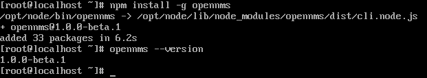
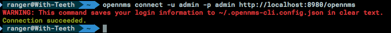
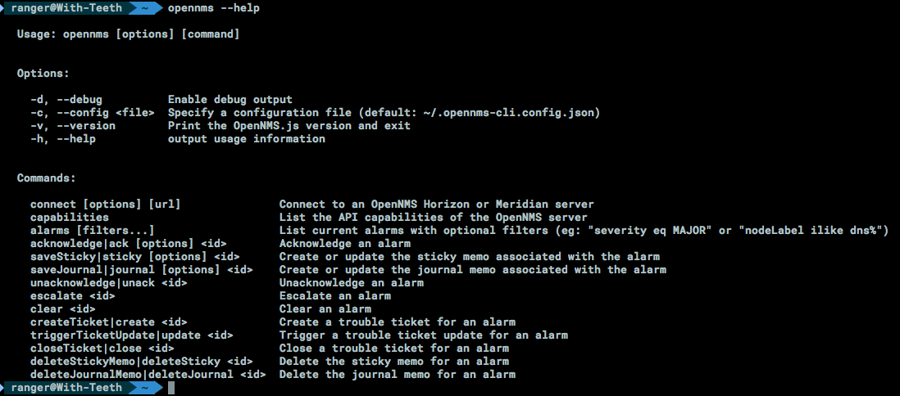
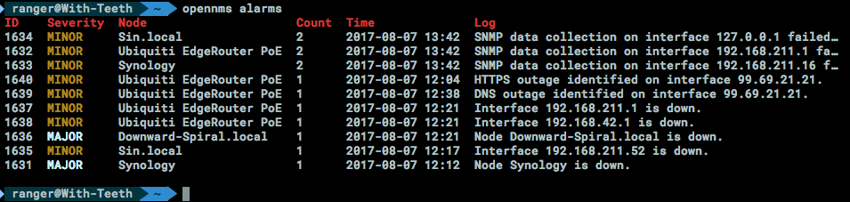
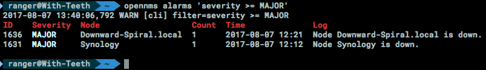

Recently, we have been working on a project called "Helm" which will integrate a convenient OpenNMS alarm dashboard into [Grafana](https://grafana.com/).  As part of that process, we have been developing a pure-JavaScript API for interacting with OpenNMS's ReST services called "[OpenNMS.js](https://github.com/OpenNMS/opennms-js)".

OpenNMS.js is primarily designed for developers, making it easy to write [Node.js](https://nodejs.org/) or browser tools for performing actions in OpenNMS.  However, OpenNMS.js is _also_ a CLI tool that lets you perform a number of useful actions from a shell prompt.  More on that below.

# Supported Features

We still have a lot of functionality to add to OpenNMS.js, but it can already query and update (ack/unack/clear/escalate) alarms, as well as open, update, and close trouble tickets on alarms.  It can also query events and nodes.

Going forward, the plan is to add support for retrieving outage and notification information, interacting with the provisioning system, and just about anything else we can think of exposing through the OpenNMS ReST APIs.

# Using OpenNMS.js in Your Project

OpenNMS.js is available through [npm, the Node package manager](https://www.npmjs.com/package/opennms), just like most other JavaScript tools.  Once you have [installed Node.js](https://nodejs.org/en/download/), just run `npm install opennms` to include it in your node project.

[A brief HOWTO document](https://github.com/OpenNMS/opennms-js/blob/master/HOWTO.md) is in the GitHub repo showing how to perform tasks using the OpenNMS.js APIs, but the gist of it is you just need to `connect` to a server, and then you can perform actions using the available client APIs:

```javascript
import {API, Model, Rest, DAO, Client} from 'opennms/src/API';

new Client().connect('Demo', 'https://demo.opennms.org/opennms', 'demo', 'demo').then((client) => {
  // do something
});
```

Complete API documentation is available at [docs.opennms.org](http://docs.opennms.org/opennms-js/branches/master/opennms-js/opennms-js.html).

# Using OpenNMS.js on the Command Line

Once you have [installed Node.js](https://nodejs.org/en/download/), just run `sudo npm install -g opennms` (note the `-g`) to install OpenNMS.js onto your system.



## Connecting and Running Commands

Once you have installed OpenNMS.js, you must "connect" to an OpenNMS server, using the `opennms connect` command:



Then, you can run any of the supported commands listed in `opennms --help`:



For example, to list the current alarms on the OpenNMS system, just run `opennms alarms`:



You can also filter based on properties of the OpenNMS alarms, just like you can when making ReST calls:



# Wrapping Up

Obviously, OpenNMS.js is primarily focused on alarm functionality at the moment, but the long-term goal is to be able to replace the collection of utilities like `send-event.pl` and `provision.pl` and provide a unified interface for accessing OpenNMS. OpenNMS.js is capable of talking with multiple OpenNMS versions cleanly, falling back to older APIs when possible.
