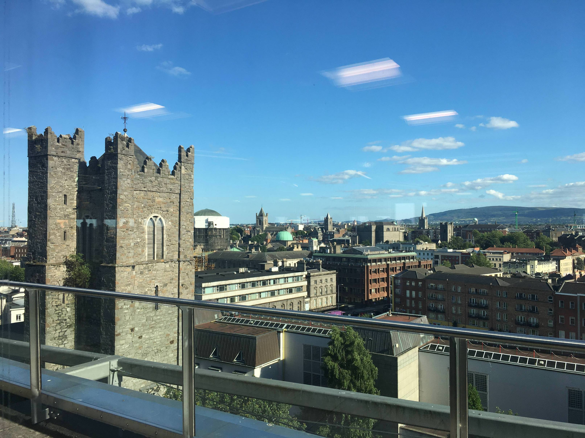
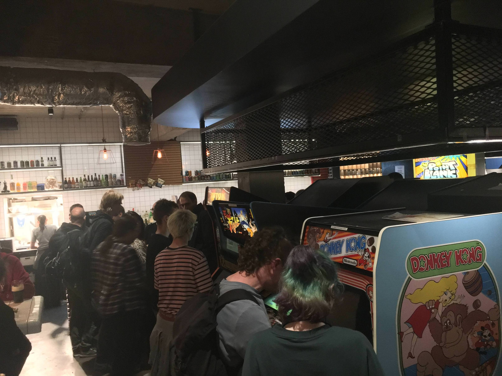
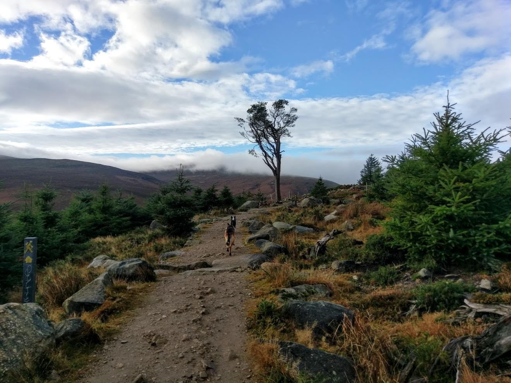
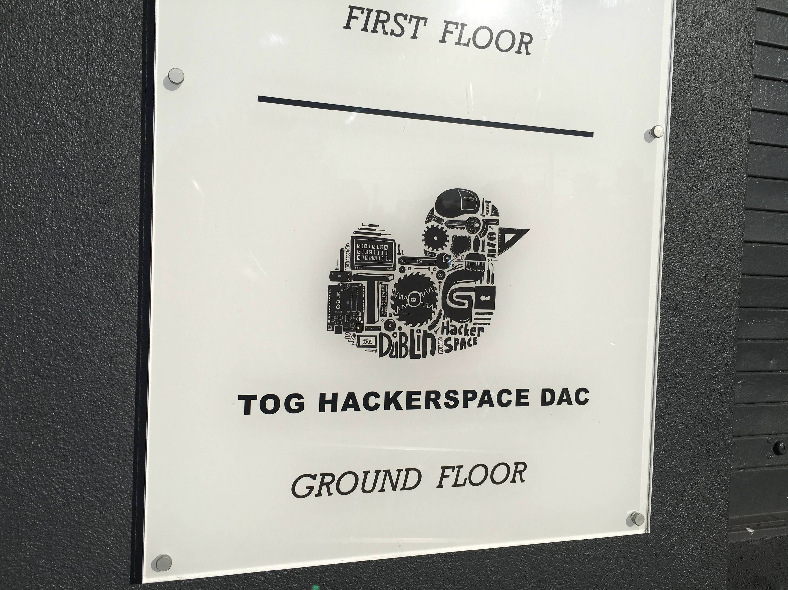
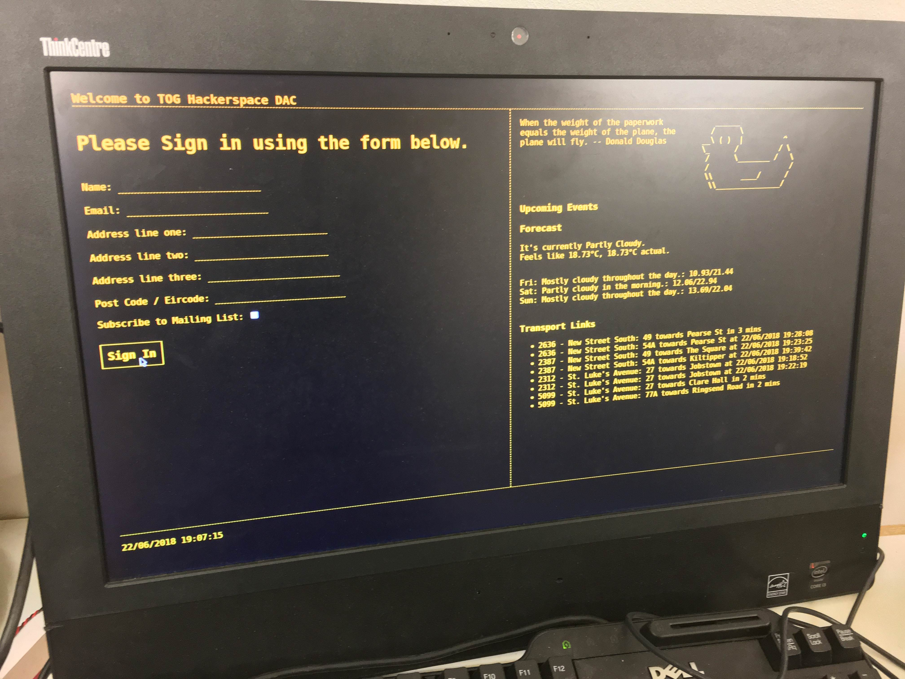
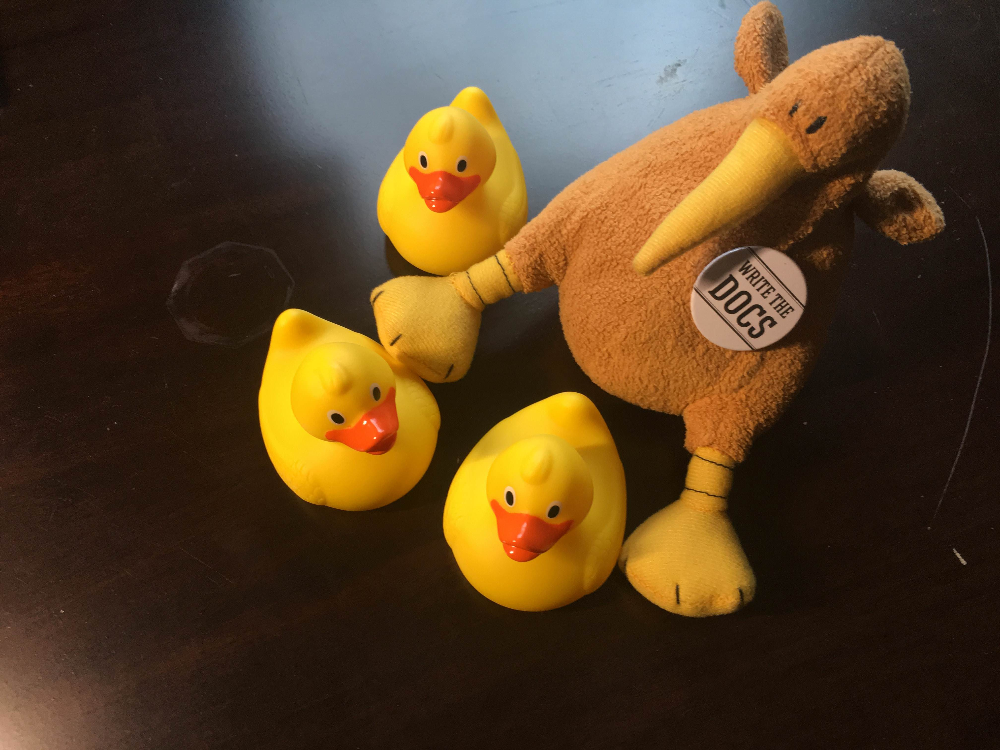
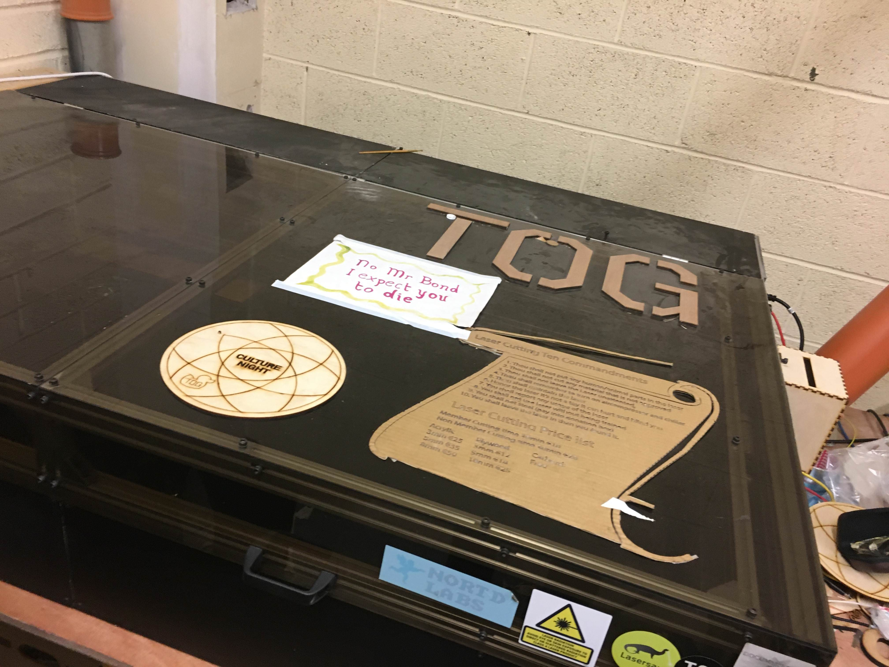
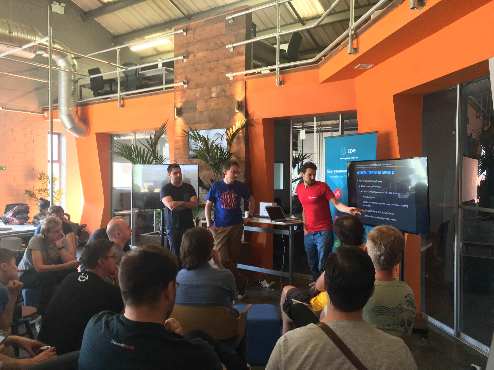
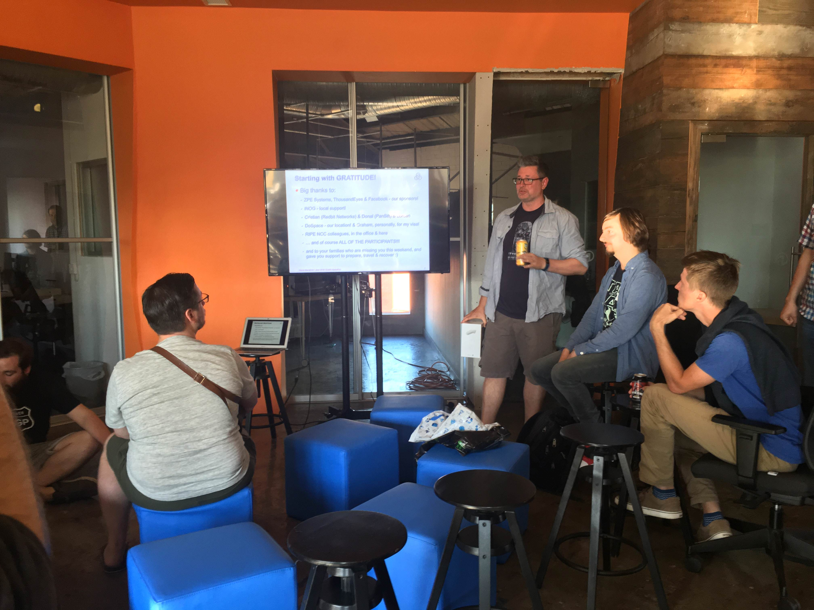
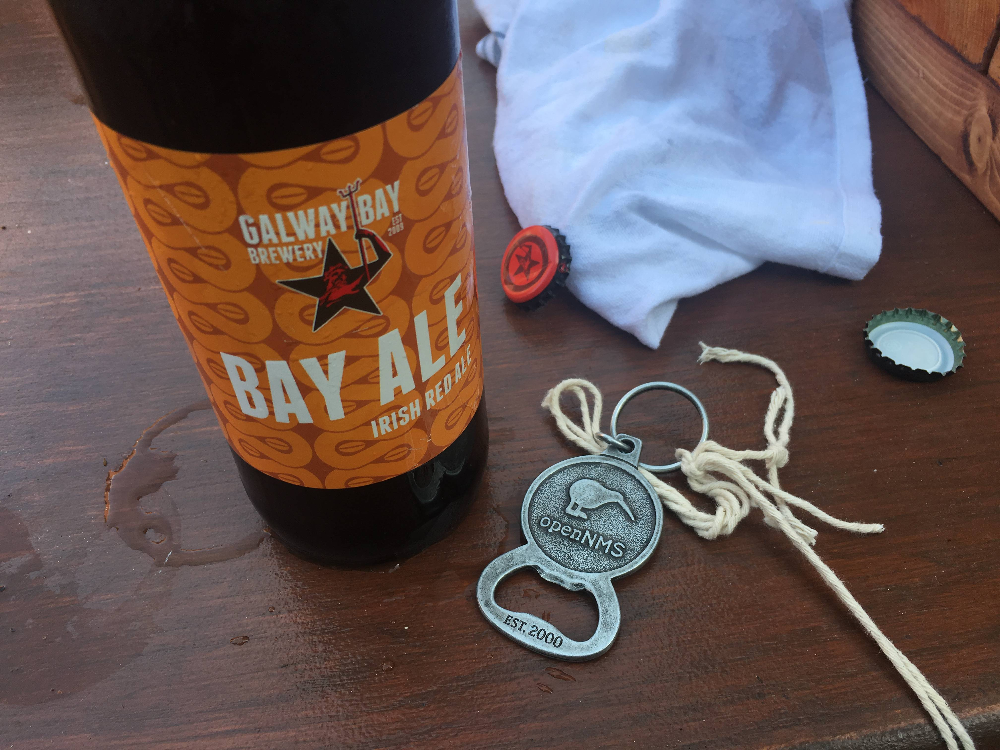

Our UK OpenNMS ambassador, Craig Gallen, gave us a hint about a meeting from the [Irish Network Operators Group (iNOG)](https://inog.net) followed by a 2 day [Network Operators Tools Hackathon](https://labs.ripe.net/Members/becha/join-network-operators-tools-hackathon) co-hosted by [Ripe NCC](https://www.ripe.net). I've attended a few NOG meetings already and like the tech-driven and very friendly atmosphere. Luckily, The OpenNMS Group sponsored the trip and so I was able to get myself first time to Dublin.

The iNOG meeting was hosted by [Workday](https://www.workday.com) in their office in Dublin. We started at 6:00 PM with some presentations until 9:00 PM. We had some time to hangout with pizza until 22:00 PM. Everybody helped to cleanup and then we moved to [Token Dublin](https://tokendublin.ie).

The iNOG team has very good taste, we came into a bar stuffed with a nice selection of [Video Games](https://www.facebook.com/notes/token-dublin/games-at-token-dublin/1927076684190151). To keep the crowd entertained between the iNOG meeting and the Hackathon on weekend, they organized a 3h hiking tour with a 8km loop in the Wicklow hills. I skipped the hiking tour and spend some time with Craig and Patrick Tuite. I regretted skipping the hiking tour a little when I saw this picture.

Friday evening was a visit at the [TOG Hackerspace](https://www.tog.ie) in Dublin arranged. They gave us a tour through their facilities.

Funny thing, when you visit the space, you have to sign in because of insurance reasons :) They build a nice amber colored terminal for the sign-in.

Ulf made a few friends and their mascot is a yellow rubber duck. I got a few as a friendly greeting for the [Hackerspace in Fulda](https://mag.lab.sh/) and the [Shackspace in Stuttgart](https://shackspace.de).
 

The list of what you can do at the space is pretty amazing. Beside 3D printing and using computers in very creative ways, you can work with a laser cutter, brew beer or work on your motorcycle engine.

The Hackerspace is very well equiped and the facility is huge and easy to reach in the middle of Dublin. As you can imagine - it is expensive. So if you want to help them to keep it open donate or [sign-up](https://www.tog.ie/membership/) for a Membership.

The Hackathon around Network Operation Tools started on Saturday. The event was hosted at the [DoSpace](https://dospace.io), which is a coworking space in Dublin. They have a open and modern facility which gave us a very nice working environment. The Hackathon was extremly well structured, people pitched a project and the ones who are interested joined. There was short status update on Friday evening with possibilities to regroup.

I got in contact with an engineer from [Arista](https://www.arista.com) and we did some research to get [Arista Streaming Telemetry](https://www.arista.com/en/solutions/telemetry-analytics) based on [OpenConfig](http://www.openconfig.net/) into OpenNMS. We worked with their [vEOS Virtual Box based images](https://eos.arista.com/veos-running-eos-in-a-vm/) and they made tiny test network. I ran in some trouble to get [gRPC](https://grpc.io) for [gNMI](https://github.com/openconfig/gnmi) and [OSGi](https://www.osgi.org) happy and got blocked. To get something done until Sunday, we have investigated a possiblity to stream data from Arista into [Kafka Streaming Platform](https://kafka.apache.org) which is also used by OpenNMS.

Cause the stack is a little bit more complicated, we decided to build a Docker based playground to bring all the bits and pieces together. The goal was, spin up an environment with:

* two Arista switches with a configuration for a management network and a a point to point link
* Kafka Cluster with Zookeeper
* Configure Streaming telemetry to Kafka from Arista switches and see if we can get it to work

Suprisingly, it is possible to run the Arista EOS in a container named [cEOS](https://www.youtube.com/watch?v=-h2GISFM0s0). I worked already with Arista in earlier days and like their stuff already, but when I saw this I became an Arista fanboy :). We have documented our findings in the OpenNMS Wiki [Arista Telemetry Streaming Wiki page](https://wiki.opennms.org/wiki/DevProjects/Telemetry_Arista_EOS).

Craig Gallen and Patrick Tuite from [Enet](https://www.enet.ie) spent some time to collect metrics from AWS CloudWatch using his  developed [MQTT Plugin](https://github.com/gallenc/opennms-mqtt-plugin).

All teams presented their projects on the last day. It is quite impressive how much a few people can get done in just 2 days. At the time of this writing, the video material is not fully published. If you are interested you can subscribe their [iNOGNET YouTube Channel](https://www.youtube.com/channel/UCBl3zIF_JJZd1iOjvU1ItZw) to get notified when new content is published. For any other published material, you can join the [iNOG slack channel](https://join.slack.com/t/inog/shared_invite/enQtMzI1MjExMzIyMTc5LWZiNzk0ZWI5YjJhYzA4ODFiYzg2MjhkOTMwNGVjOGU2YjRhZWU2YjIyMjdjZGFlNDg5MTk5MjgwNjU2OTQ3NDU) to keep informed.

I want to say a big thank you to all sponsors, organizers and volunteers who made this event possible. Cheers and see you maybe soon at the next [RIPE NCC Hackathon](https://labs.ripe.net/Members/becha/two-ripe-ncc-hackathons-in-2018-tools-for-network-operators-and-quantum-internet).

