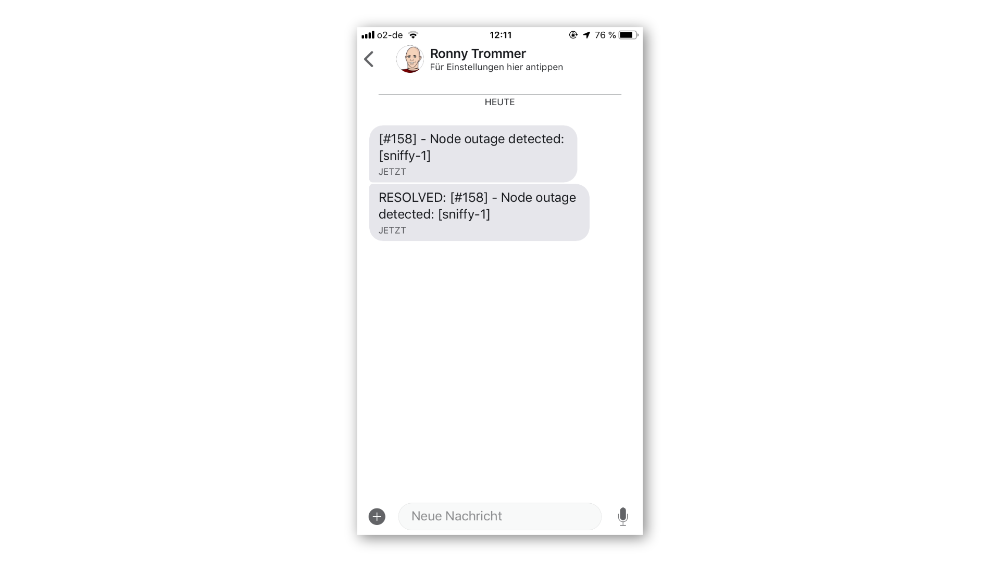

In some cases it is nice to have notifications from OpenNMS in a separate channel on a smartphone and you don't want to pay for SMS.
Here is a tutorial where I use [Signal](https://signal.org) using the [signal-cli](https://github.com/AsamK/signal-cli/releases).

This Howto will describe how to download the latest signal-cli tool, link it to your existing Signal account and how to configure OpenNMS to use it as a notification target.
You should have already an OpenNMS Horizon or Meridian running and you need a Signal account with the Signal app installed and configured on your smartphone.

#### Configuration

**Step 1: Download and extract the signal-cli tool**

We get a copy of the released files and extract the signal-cli to /opt/signal-cli on your OpenNMS server.

```bash
cd /opt
curl -L https://github.com/AsamK/signal-cli/releases/download/v0.6.0/signal-cli-0.6.0.tar.gz | tar xz
mv signal-cli-0.6.0 signal-cli
```

**Step 2: Link your existing Signal account with signal-cli**

```bash
cd /opt/signal-cli/bin
./signal-cli link -n my-opennms
tsdevice:/?uuid=ADW2cD2XjA7IX4arL9U7eQ&pub_key=BTrFfDdAJdaZ%2b%2FB05BsxelnrpQZT5sRJh2S7yb4fp1aO
```

Generate a QR Code from the link, I've used an online QR code generator [https://www.qrstuff.com](https://www.qrstuff.com).

Use "Plain Text" and use "Static - Embed text into code as-is".
Paste the tsdevice URL and download the generated QR code image.
You can now scan it with your Signal app which links your signal-cli to your account which is identified by your phone number.

Test if you can send yourself a message with (`-u` is your phone number with country code):

```bash
./signal-cli -u +4912345789 send -m "This is my first message" +4912345789
```

Important for our integration:

* `-u +4912345789`: This is the user which sends the notification
* `-m "the message": The message content which will be sent
* `+4912345789`: The phone number of the recipient, in this case I send it to myself but can also be a collegue

The encryption and keys for *Signal* are stored in the home directory of your logged-in user which is `/root/.config`.

**Step 3: Create a wrapper script which can be used as a custom notification in OpenNMS**

To make the integration a little bit easier, I wrapped it up in a small script `/opt/signal/bin/signal-cliw.sh`

```bash
#!/bin/bash -e

SIGNAL_BINARY=/opt/signal/bin/signal-cli
LINKED_USER=+4912345789
MESSAGE="${2}"
RECIPIENT="${1}"
CONFIG=/root/.config
ERROR_LOG=/var/log/signal-cli.log

${SIGNAL_BINARY} -u "${LINKED_USER}" send -m "${MESSAGE}" "${RECIPIENT}" 2>>${ERROR_LOG}
```

Ensure the script is executable with `chmod +x signal-cliw.sh`.
You can use it now like this:

```bash
./signal-cliw.sh <target-phone-number> "<text message>"
```

**Step 4: Integration in OpenNMS**

Add a new notification command in `${OPENNMS_HOME}/etc/notificationCommands.xml`:

```xml
<command binary="true">
  <name>signal-cli</name>
    <execute>/opt/signal/bin/signal-cliw.sh</execute>
    <comment>Signal CLI</comment>
    <argument streamed="false">
      <switch>-mphone</switch>
    </argument>
    <argument streamed="false">
      <switch>-nm</switch>
    </argument>
</command>
```

As first argument for the `signal-cliw.sh` script is the *Mobile Phone* number used from a configured OpenNMS user.
The second argument we pass with `-nm` is a short message text to our script which is configured in the the notification itself.
Restart OpenNMS so the changes will be applied.

**Step 5: Create a new Destination Path which uses Signal**

Create a notification *destination path* which uses your newly created *signal-cli* notification command.

[plugin:youtube](https://www.youtube.com/watch?v=rV_pr1fed9s)

**Step 6: Add a mobile phone number in your user account**

[plugin:youtube](https://www.youtube.com/watch?v=nQYLkIUoDUk)

**Step 7: Configure a notification to use our new destination path**

[plugin:youtube](https://www.youtube.com/watch?v=DyuETrrC0Z4)

**Step 8: Enable Notifications**

[plugin:youtube](https://www.youtube.com/watch?v=gRw9379_uZc)

**Step 9: Test Notification**

[plugin:youtube](https://www.youtube.com/watch?v=vgoxwkKATY0)

Check if you get a notification for a node outage and a resolved message.



#### Troubleshooting

If you have issues getting the integration running, *Notifd* is the main component which drives the bits and pieces and writes log files to `${OPENNMS_HOME/logs/notfid.log`.
In case you need a more verbose output you can increase the log level value in `${OPENNMS_HOME/etc/log4j2.xml` by changing the `value` from `WARN` to `DEBUG` in the line below.
The changes will be picked up automatically and you don't need a restart.

```xml
<KeyValuePair key="notifd" value="DEBUG" />
```

If you have devices on very unreliable internet connections, you can set an initial delay which ensures you only get notifications when the outage exists for a certain amount of time.

[UPDATE - 2018-11-05]

We have added a editable version of this article in our wiki: https://wiki.opennms.org/wiki/Using_Signal_as_Notification

gl & hf
