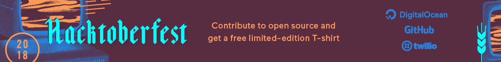

Hacktoberfest is a way to celebrate open source during an entire month.
If you make 5 Pull Requests from 1st October - 31st October you get a limited free T-Shirt.
We have collected a few low level issues in a JIRA Epic called [Paper Cut Issues](https://issues.opennms.org/browse/NMS-8191), you can pick any open issue you like, these are the ones which have a low barrier to solve.

## Requirements

* You have to sign and send us an [OpenNMS Contribution Agreement](https://wiki.opennms.org/wiki/images/6/6b/ContributorAgreement.pdf)
* You need an account to our public [JIRA instance](https://issues.opennms.org)
* You need an [GitHub account](https://github.com)
* Sign up to participate at the [Hacktoberfest](https://hacktoberfest.digitalocean.com/sign_up/register)

## How can I make my first contribution?

* Fork OpenNMS and create a branch with the JIRA issue number you want to work on from develop, e.g. `issue/NMS-6446`
* Set the issue in JIRA to "Start Progress" and assign it to your JIRA user
* Create a Pull Request in the upstream OpenNMS project against `develop` and set the JIRA issue to "Review"

If you want more details how we maintain and manage our project read our [Contribution Guide](https://wiki.opennms.org/wiki/Community/Welcome_Guide#Contribution) or talk with us in our [Chat](https://chat.opennms.com).
